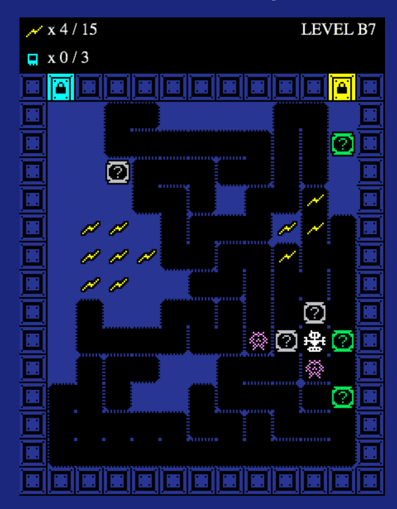

#Bisby's Escape

A 7-day roguelike about digging tunnels and dropping crates.  

Made for the 2106 7-day Roguelike Challenge.

#Play Now

[http://walsh9.github.io/7drl2016/](http://walsh9.github.io/7drl2016/)

#Description

Control Bisby with arrow keys, hjkl, or number pad.
You can clear levels in two different ways:  

- Collect all the yellow energy units and open the yellow gate.
- Crush enemies with crates, collect their blue datachips, and open the blue gate.

Guide Bisby safely through 7 levels to reach the surface.

#Tips

- You can push crates from the sides, even through dirt.
- Even dangerous crates have uses.
- It's turn-based. Enemies only move after you move. Take your time!

#Changelog

## v1.2.1
- Press space to restart instead of any key
- Bug fixes

## v1.2.0
- Animated motion between tiles
- Sound effects! Toggle with 'S'.
- Crate turn order changed. Crates always go after enemies take their turns.
- Bug fixes

## v1.1
- Bug fixes

## v7DRL

Seven-day version features:  

- Random tunnels
- Random crates
- Enemies
- 7 levels
- 2 ways to pass levels
- Losing
- Winning
- Victory screen

#Inspirations
- Dig Dug
- Mr. Do!
- Digger
- Bomberman

#License

© Matt Walsh 2016, released under the MIT License